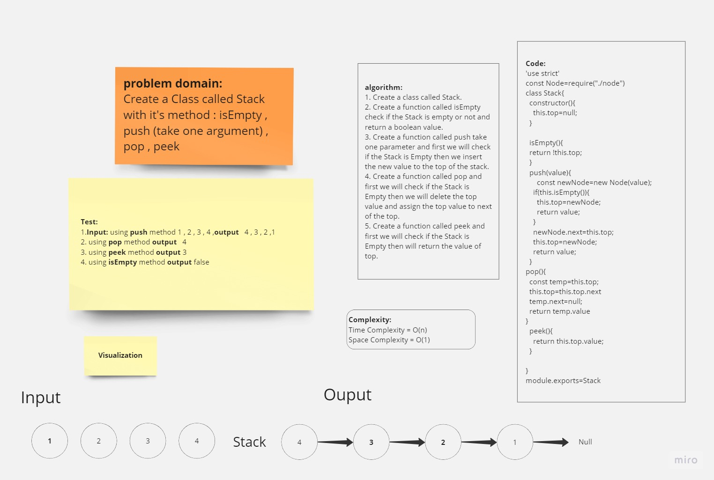
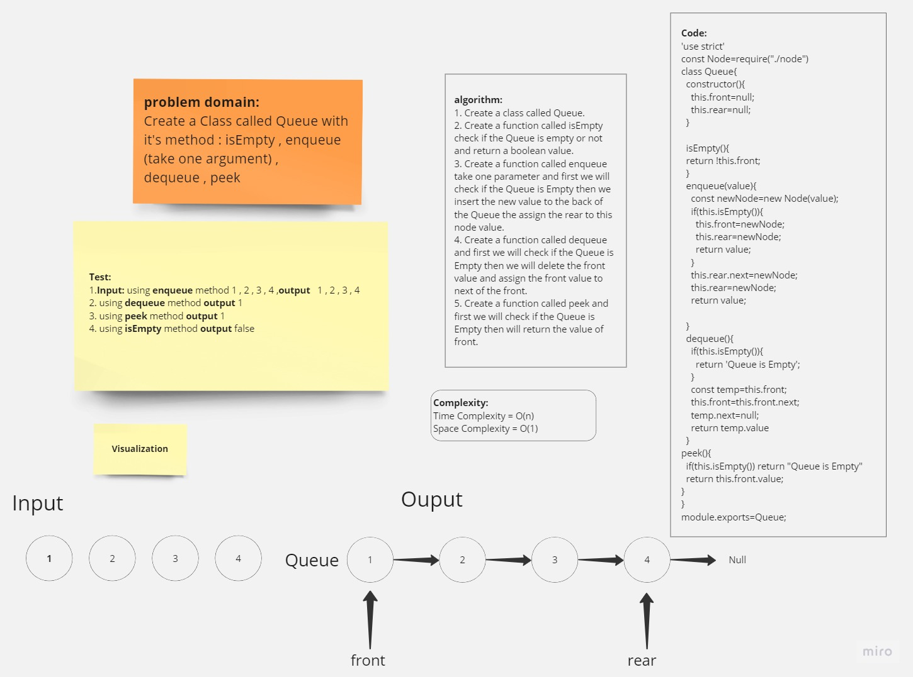

# Stack-Queue

## Whiteboard

### Stacks:
A stack is a linear data structure that follows the Last-In-First-Out (LIFO) principle. Imagine a stack of books, where you can only access the topmost book. The last book placed on the stack is the first one to be removed.
WHY: Stacks are used when we need to perform operations in a specific order, such as undoing actions or evaluating mathematical expressions.

WHAT: A stack consists of two main operations: push and pop. Push adds an element to the top of the stack, while pop removes the topmost element.

### Stack-White-Borad

### Queues:
A queue is a linear data structure that follows the First-In-First-Out (FIFO) principle. Think of a queue at a ticket counter, where the person who arrives first gets served first.
WHY: Queues are used when operations need to be performed in the order of arrival, such as managing processes or handling requests.

WHAT: A queue supports two main operations: enqueue and dequeue. Enqueue adds an element to the end of the queue, while dequeue removes the element from the front.
### Queue-White-Borad

