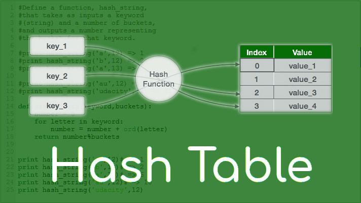
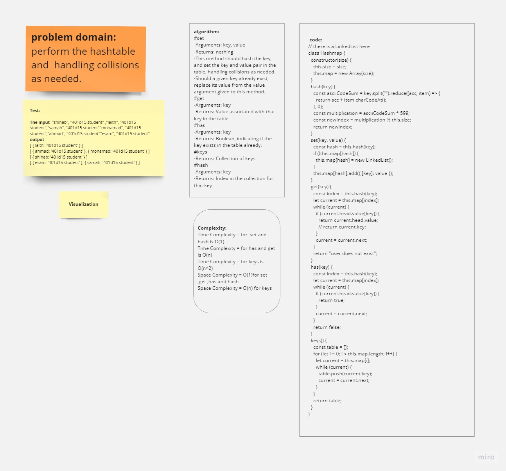

# HashTable  

***A hash table, also known as a hash map, is a data structure that allows for efficient storage and retrieval of key-value pairs. It provides a way to associate a value with a unique key and is particularly useful when you need to quickly access and update values based on their keys.The core idea behind a hash table is the use of a hash function. A hash function takes an input (the key) and generates a fixed-size value, which is used as an index or address in an array. The value produced by the hash function is used to determine where the corresponding value associated with the key should be stored or retrieved in the array.***  

### HashTable-White-Borad  

