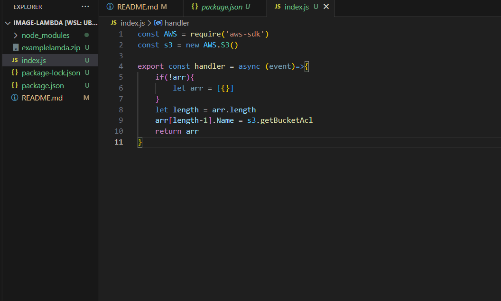

# image-lambda
## work as a team
(repo-team-work)[https://github.com/MohammedAbuEssa/image-lambda-main/tree/main]
- a description of how to use your lambda.
- we will search of lamda on aws
- press create function
- choose author from scratch and write the func name then as a normal user press on create new role
- search of S3
- click create create bucket
- then write name of the bucket and choose ACLs enabled
- uncheck block all public access
- then press create bucket
- then go inside it and upload any file or folder you want to add
- then go back to the lamda and press add triger and add the s3 to it
- then change the permission to read for all
## a description of any issues you encountered during deployment of this lambda.
I face an error that called 'Log group does not exist The specific log group: /aws/lambda/test does not exist in this account or region. '
